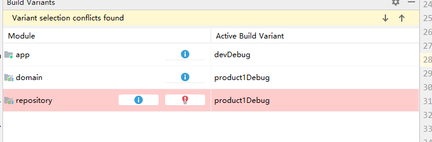

# Android Gradle Product Flavors
本例子是解决 android module 之间的 product flavors 依赖关系

## Library productFlavors 使用

app module
```
defaultConfig{
    ...
     flavorDimensions "app"
}
 productFlavors{
        dev{
           ...
        }

        beta{
            ...
        }
    }

```

domain module
```
defaultConfig{
    ....
     flavorDimensions "domain"
}

 productFlavors {
        product1 {
            ...
        }

        product2 {
            ... 
        }

    }

```
repository module

```
 productFlavors {
        product1 {
            ....
        }

        product2 {
           ...
        }

    }

```

依赖关系
```
App Module <- Domain Module <- Repository Module
```

如果我要形成以下的依赖方式
```
App Module dev <- Domain Module product1 <- Repository Module product1
```

那么
```
app module
 
productFlavors {
        dev {
           missingDimensionStrategy "domain","product1"
           missingDimensionStrategy "repository","product1"
        }

}

Domain Module 

productFlavors {
        product1 {
            missingDimensionStrategy "repository","product1"
        }

        product2 {
            missingDimensionStrategy "repository","product2"
        }

}


```

但是如果有这种情况
```
App Module dev <- Domain Module product1
App Module dev <- Repository Module product2
Domain Module product1 <- Repository Module product1


ex:
app module
 
productFlavors {
        dev {
           missingDimensionStrategy "domain","product1"
           missingDimensionStrategy "repository","product2"
        }

}

Domain Module 

productFlavors {
        product1 {
            missingDimensionStrategy "repository","product1"
        }

        product2 {
            missingDimensionStrategy "repository","product2"
        }

}

```
App Module dev 会覆盖 Domain Module product1的选择
```
App Module dev <- Domain Module product1
App Module dev <- Repository Module product2


>>> replace 
Domain Module product1 <- Repository Module product1
>>> to  
Domain Module product1 <- Repository Module product2

```
并且还有提示



因此在开发过程中需要注意这个问题

## 结论
productFlavors 的选择是 依赖从上到下 优先级降低。

## 参考
动态改变Library productFlavors:[link](https://blog.csdn.net/u012149399/article/details/88124473)